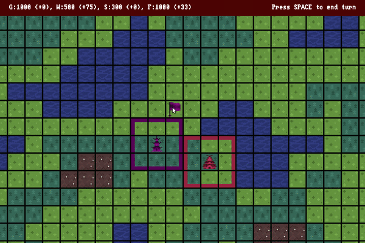
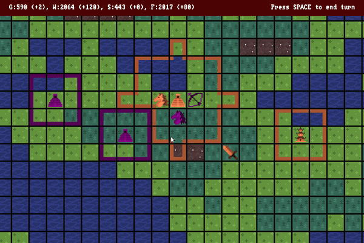
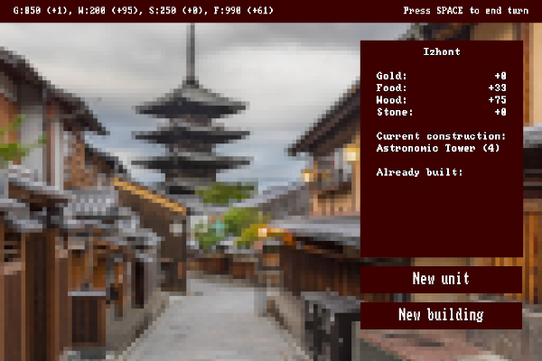
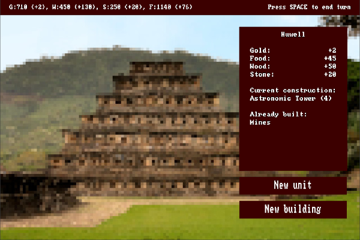
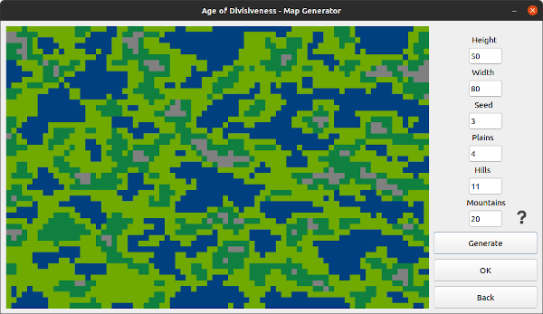

## Game Description
In a time of great conflict, new kingdoms are born in minds of ambitious rules and willing hearts of dedicated serfs. 
Every great kingdom needs a powerful **army**, vivid homeland **culture** and thoughtful **diplomacy**.
Be ready to conquer civilizations and win extensive battles, in which the key to defeating your enemy will be both hands and minds.  
Will you win by being a despotic tyrant or maybe by creating a web of secret pacts?  
Will your kingdom story be written by romantic tales or fearful half lies?  
Nevertheless, keep your kingdom in order and do not find your domain in the age of divisiveness.

## Creators
* [Patryk Majewski](https://github.com/chceswieta)
* [Krzysztof Szymaniak](https://github.com/krzysztof-szymaniak)
* [Gabriel Wechta](https://github.com/GabrielWechta)
* [Błażej Wróbel](https://github.com/bwcs99)

This project was created as part of a university course at *Wrocław University of Science and Technology.*

## Technologies
* Python 3.8
* Arcade 2.5.2
* PyQt 5.10.1
* opencv-python 4.4.0.46

## Features
* Fun and complex tactics,
* Many interdependent mechanics,
* Client-Server architecture,
* Great pixel-art style graphics,
* Strong Civilization I and old Settlers vibe,
* Multiplayer by LAN,
* Many ways to rule your kingdom.

## Screenshots






## Installation
Created with game-development framework [arcade](https://arcade.academy/).

```bash
pip3 install arcade
pip3 install pyqt5
pip3 install opencv-python-headless
```

## How to run
In the main directory run
```bash
python3 main.py
```
or, if you want cheats enabled,
```bash
python3 main.py --debug
```

## Basic controls
- Use the mouse wheel to zoom in and out.
- Hold and drag the right mouse button to move the camera.
- Use the left mouse button to select a unit or a city.
- When a unit is selected, use the left mouse button to click on a blinking tile to move there; click on a plain tile to deselect the unit.
- When a city is selected, use the ESC button to return to the map.

